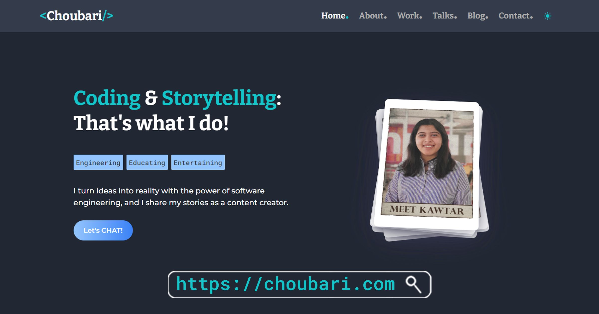

## 🛠️ Main Stack

- Next.js 13 (app directory & server components)
- TailwindCSS
- TypeScript
- ContentLayer

<p align="center">
  
</p>

## 📧 Contact

If you want to contact me regarding this project or anything else, you can use the [contact page](https://choubari.com/contact) or write to [contact@choubari.com](mailto:contact@choubari.com).

## ⭐ Liked my work?

If you found value in this open source project, you can give it a star and share it. Also, let's connect on [social media platforms](https://choubari.com/creator).

**or:**

<a href="https://www.buymeacoffee.com/choubari" aria-label="Buy me a coffee" target="_blank">

</a>

---

---

This is a [Next.js](https://nextjs.org/) project bootstrapped with [`create-next-app`](https://github.com/vercel/next.js/tree/canary/packages/create-next-app).

## Getting Started

First, run the development server:

```bash
npm run dev
# or
yarn dev
# or
pnpm dev
```

Open [http://localhost:3000](http://localhost:3000) with your browser to see the result.

You can start editing the page by modifying `app/page.tsx`. The page auto-updates as you edit the file.

[http://localhost:3000/api/hello](http://localhost:3000/api/hello) is an endpoint that uses [Route Handlers](https://beta.nextjs.org/docs/routing/route-handlers). This endpoint can be edited in `app/api/hello/route.ts`.

This project uses [`next/font`](https://nextjs.org/docs/basic-features/font-optimization) to automatically optimize and load Inter, a custom Google Font.

## Learn More

To learn more about Next.js, take a look at the following resources:

- [Next.js Documentation](https://nextjs.org/docs) - learn about Next.js features and API.
- [Learn Next.js](https://nextjs.org/learn) - an interactive Next.js tutorial.

You can check out [the Next.js GitHub repository](https://github.com/vercel/next.js/) - your feedback and contributions are welcome!

## Deploy on Vercel

The easiest way to deploy your Next.js app is to use the [Vercel Platform](https://vercel.com/new?utm_medium=default-template&filter=next.js&utm_source=create-next-app&utm_campaign=create-next-app-readme) from the creators of Next.js.

Check out our [Next.js deployment documentation](https://nextjs.org/docs/deployment) for more details.
